# Mermaid Showcase

Open this file in **MD Reader** (MD mode) to verify every Mermaid diagram type
renders. Each diagram is interactive — scroll to zoom, middle-click to pan, and
use the ⛶ button for fullscreen.

## 1. Flowchart

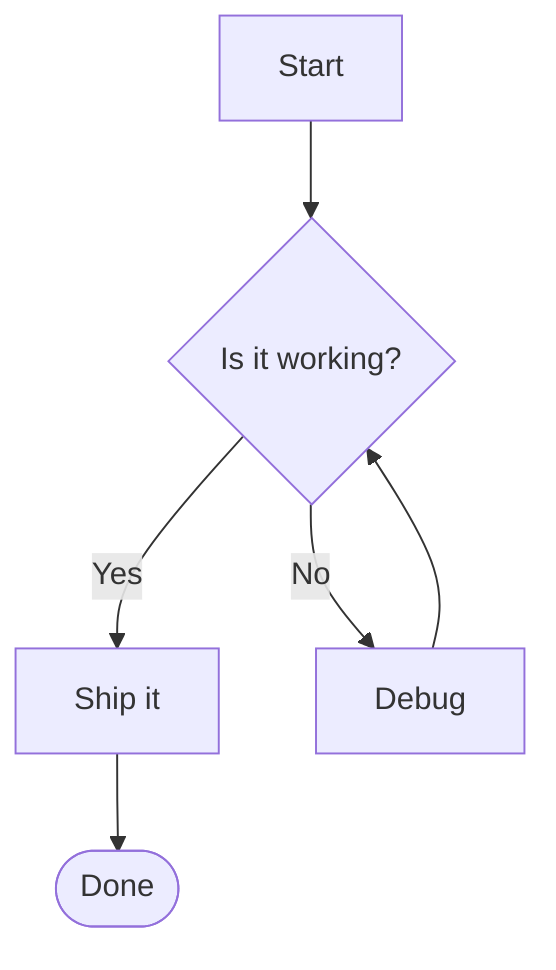

## 2. Sequence Diagram

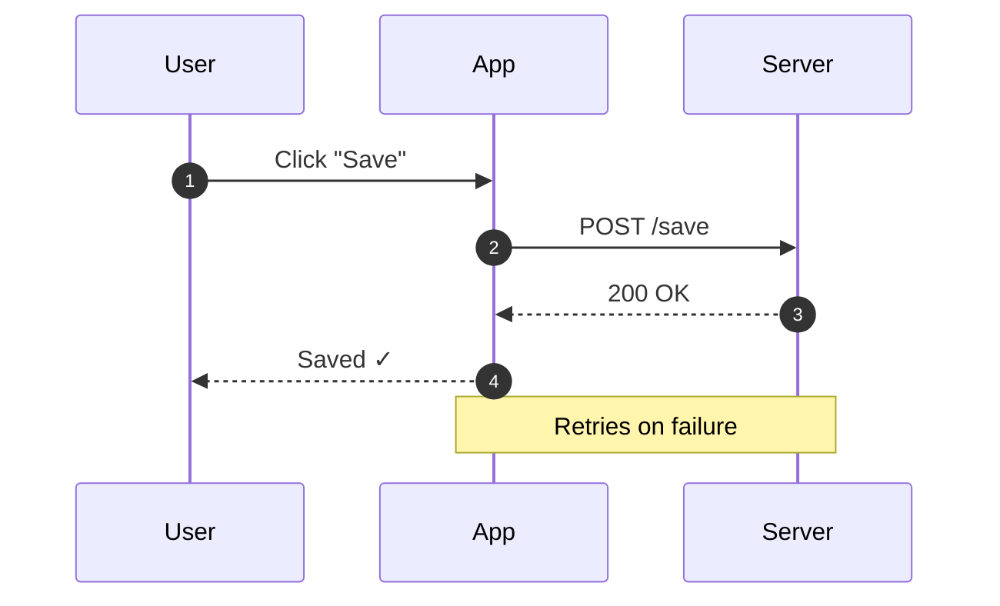

## 3. Class Diagram

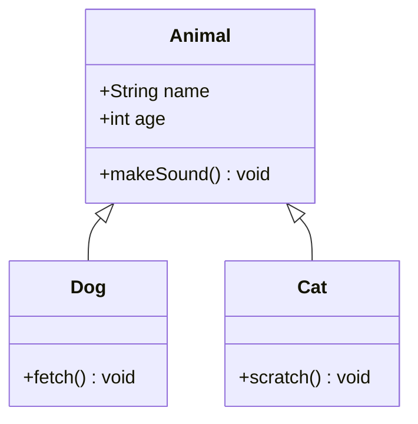

## 4. State Diagram

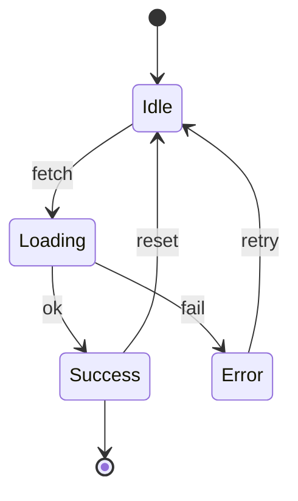

## 5. Entity Relationship Diagram

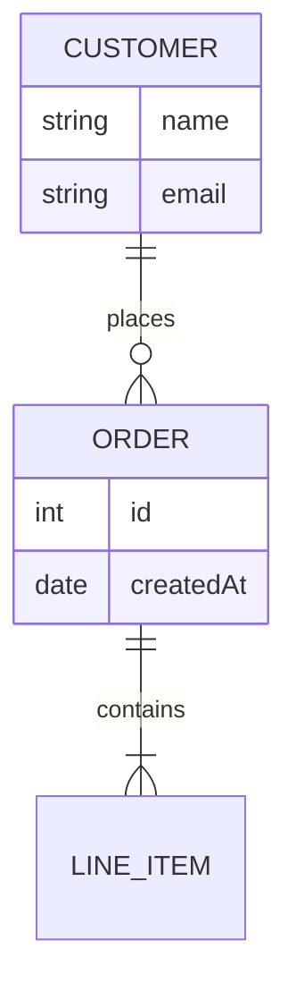

## 6. User Journey

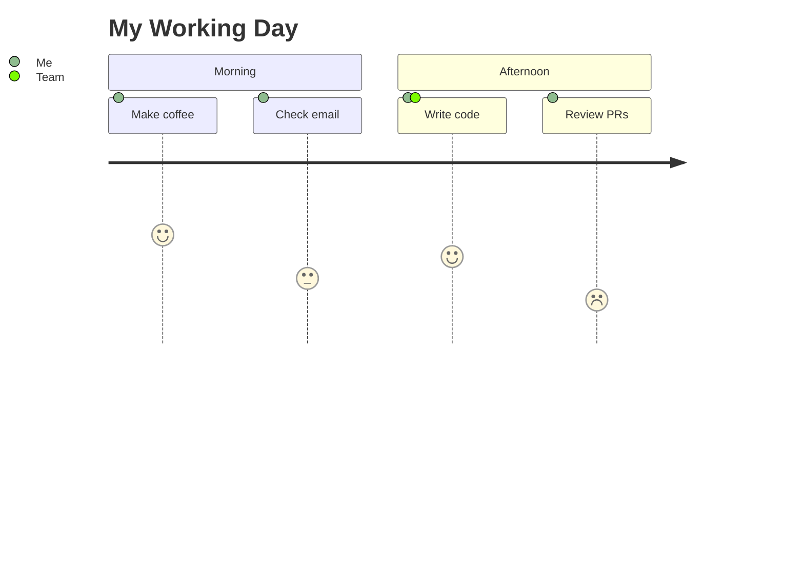

## 7. Gantt Chart

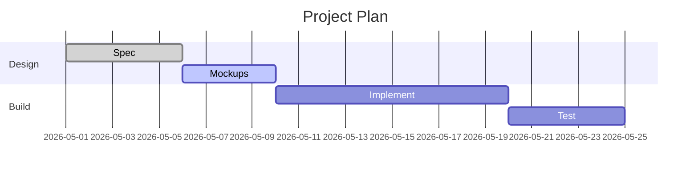

## 8. Pie Chart

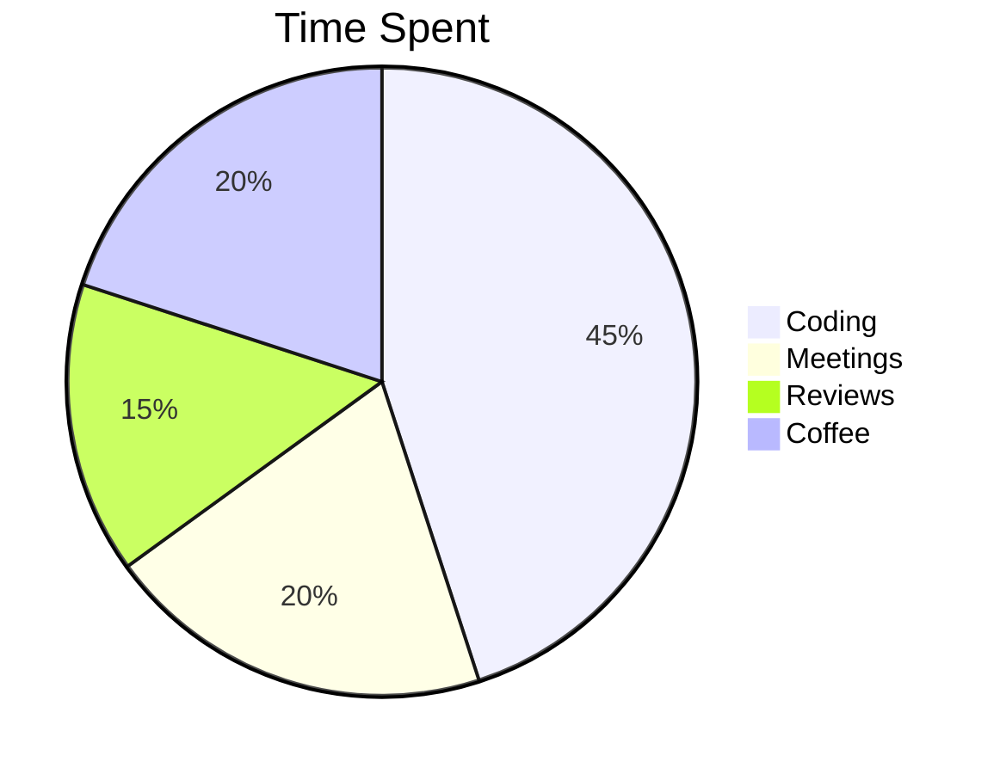

## 9. Git Graph

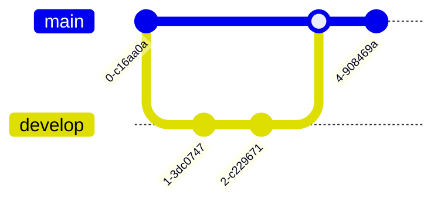

## 10. Mindmap

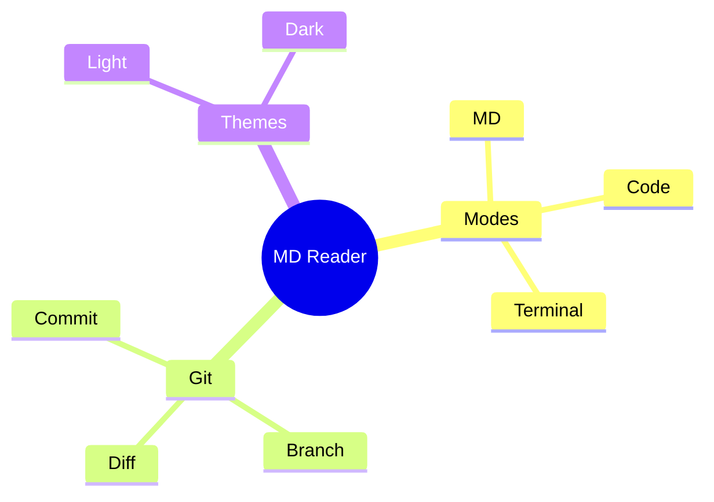

## 11. Timeline

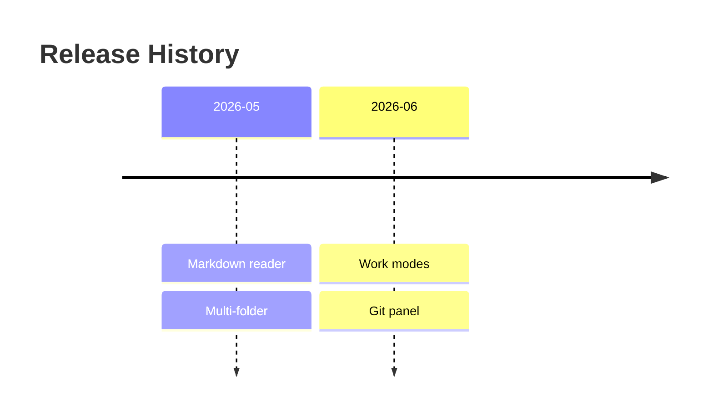

## 12. Quadrant Chart

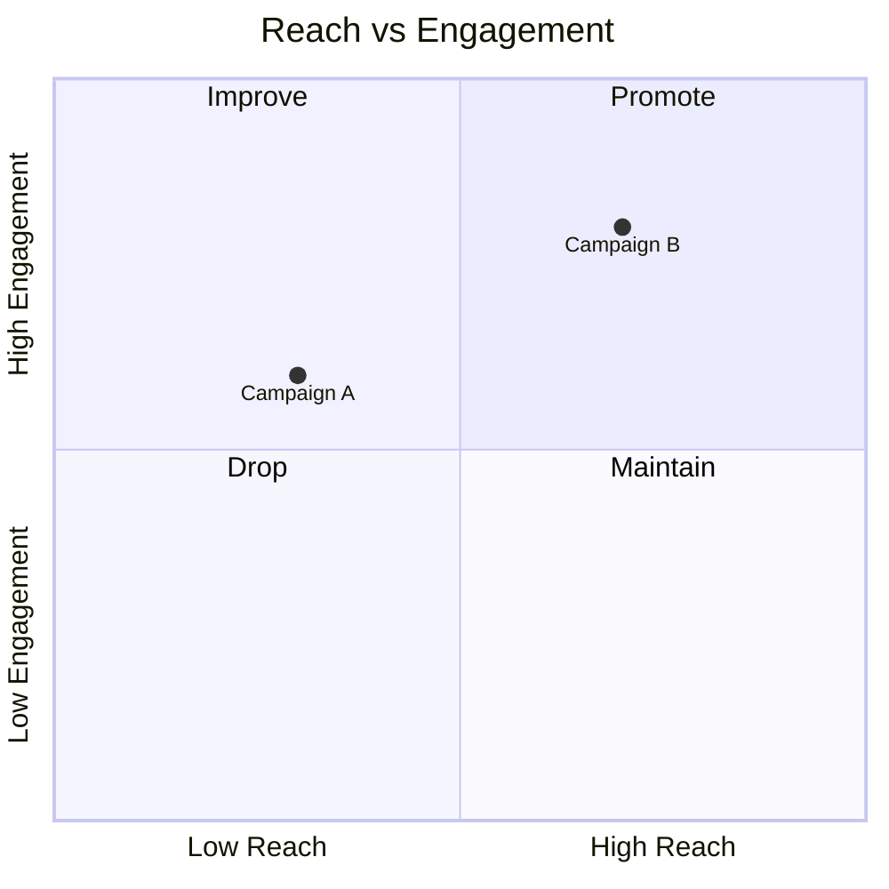

## 13. Requirement Diagram

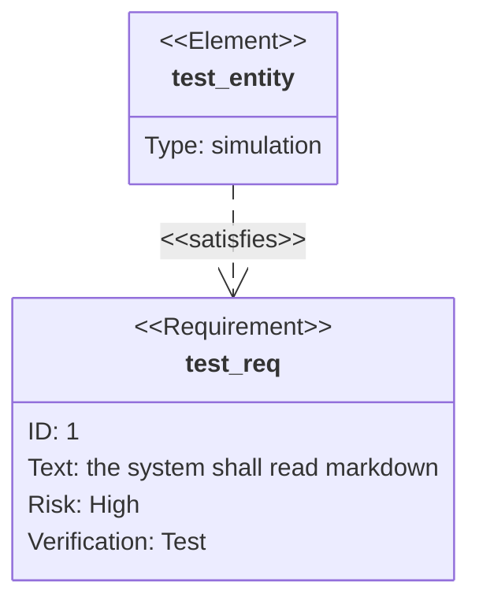

## 14. Sankey

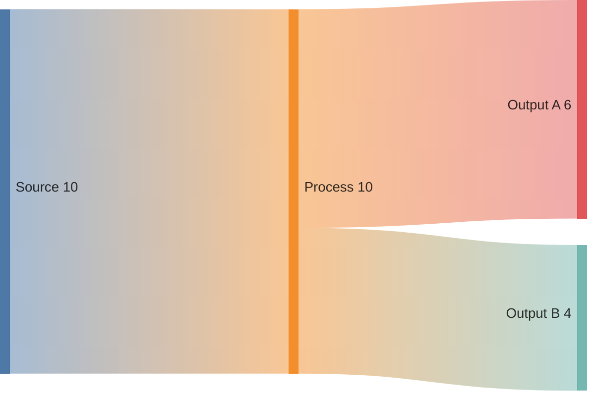

## 15. XY Chart

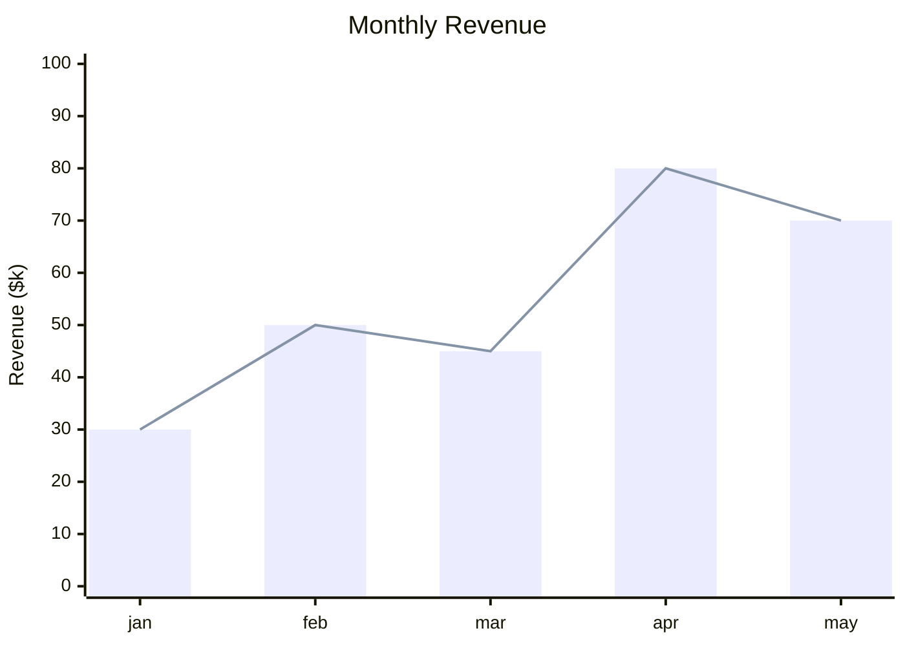

> **Note:** `block-beta` is intentionally omitted — mermaid 11.15.0 throws an
> internal "Converting circular structure to JSON" error when rendering block
> diagrams, so it cannot be displayed in any host. Remove this note if a future
> mermaid release fixes it.

## 16. C4 Context

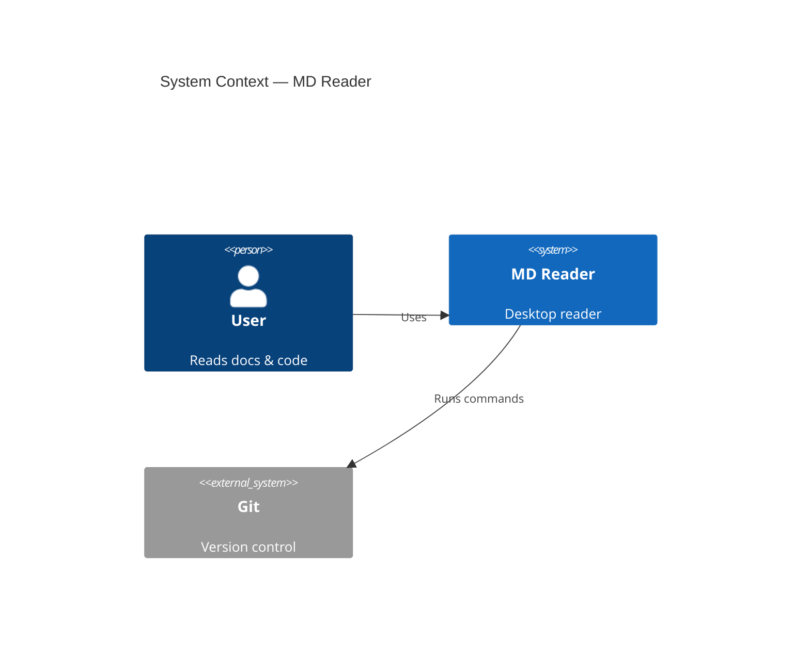

## 17. Packet

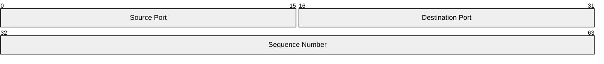
